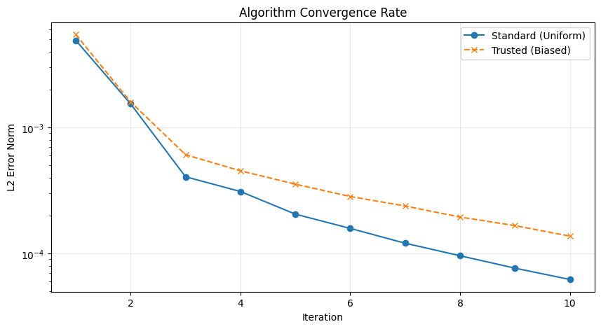
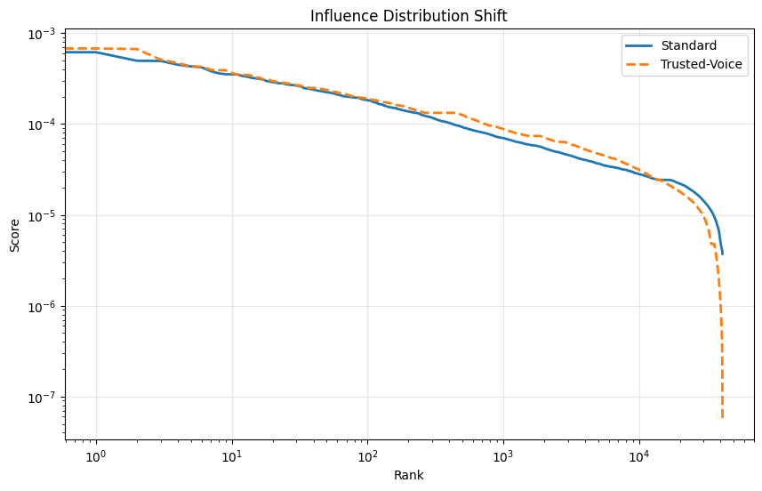

# Algorithms-for-Massive-Data-Analysis

# Link Analysis: Amazon Book Reviews 📚


A large-scale distributed graph analysis project implemented "from scratch" using **PySpark RDDs**. 

This project explores **Topic-Sensitive PageRank** to identify influential users in the Amazon Book Review network. By biasing the random walk towards "Trusted Voices" (users with high helpfulness ratings), the algorithm successfully distinguishes between high-quality reviewers and high-volume spammers.

---

## 🚀 Key Highlights
* **Scale:** Processed a graph of **41,260 users** and **2,028,440 edges** (Avg Degree: ~49).
* **Performance:** Optimized distributed matrix multiplication ($M^T \times r$) converged in **< 2 minutes** on a single-node cluster (Google Colab).
* **Engineering:** Implemented a **K-Core Topology Filter** to isolate the dense community structure from 3 million raw records.
* **Algorithm:** Custom implementation of **Topic-Sensitive PageRank** with a non-uniform teleportation vector.

---

## 📊 The Dataset
**Source:** [Amazon Book Reviews (Kaggle)](https://www.kaggle.com/datasets/mohamedbakhet/amazon-books-reviews)
* **Raw Size:** ~3,000,000 records.
* **Preprocessing Pipeline:**
    1.  **Cleaning:** Dropped null User_IDs and duplicates.
    2.  **Parsing:** Extracted "Helpfulness" metrics from raw string formats (e.g., "5/10").
    3.  **Topology Filtering (K-Core):** Retained only users with $\ge 3$ reviews and books with $\ge 5$ reviews to ensure graph connectivity.
    4.  **Sampling:** Subsampled to an 80,000-review dense core to fit 12GB RAM constraints while maintaining 2M+ edges.

---

## 🧠 Methodology

### 1. Graph Construction
We modeled the data as a **Co-Review Graph**:
* **Nodes:** Users.
* **Edges:** Undirected link if User A and User B reviewed the same book.
* **Optimization:** The adjacency matrix was built directly as a Transposed Matrix ($M^T$) using Spark's `IndexedRowMatrix` to avoid expensive shuffle operations during the iterative phase.

### 2. Algorithms
We compared two centrality measures:

| Algorithm | Teleportation Vector ($\mathbf{v}$) | Goal |
| :--- | :--- | :--- |
| **Standard PageRank** | Uniform ($1/N$ for all nodes) | Measure structural **Popularity** (Volume). |
| **Trusted-Voice PageRank** | Biased (Non-zero only for "Trusted" users) | Measure **Quality** and Reputation. |

*Definition of "Trusted User":* $>5$ total votes and a Helpfulness Ratio $>80\%$.

---

## 📈 Results & Visuals

### 1. Convergence Speed
Both algorithms demonstrated stable exponential convergence within 10 iterations.

*(Note: The Trusted variant shows slightly higher volatility due to the biased teleportation vector forcing jumps to specific nodes.)*

### 2. The "Lift" Effect
The Topic-Sensitive bias successfully re-ranked the network. High-quality users were "lifted" above the baseline popularity curve.


### 3. Rank Reversal
The top users changed significantly when optimizing for quality over quantity:
* **Standard Leader:** High volume of reviews, moderate quality.
* **Trusted Leader:** Lower volume, but nearly **100% helpfulness** ratings.

---

## 🛠️ Installation & Usage

### Prerequisites
* Google Colab (Recommended).
* Kaggle Account (for API credentials).

### Running the Project
1.  Clone this repository or open the notebook in Google Colab.
2.  Upload `PageRank_Project.ipynb` to Google Colab.
3.  **Set up Credentials:**
    * Click the **Secrets (🔑)** icon in the Colab sidebar.
    * Add a new secret named `KAGGLE_USERNAME` with your username.
    * Add a new secret named `KAGGLE_KEY` with your API key.
    * Toggle "Notebook access" to **On** for both.
4.  Run all cells. The notebook will automatically fetch the dataset using these credentials.

```bash
# Data download is handled automatically via the Colab Secrets API
!kaggle datasets download -d mohamedbakhet/amazon-books-reviews
